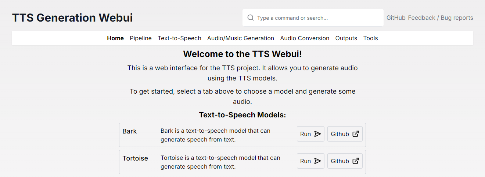
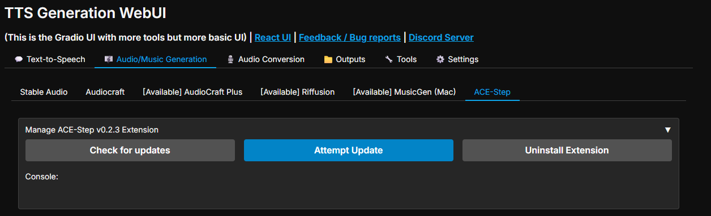
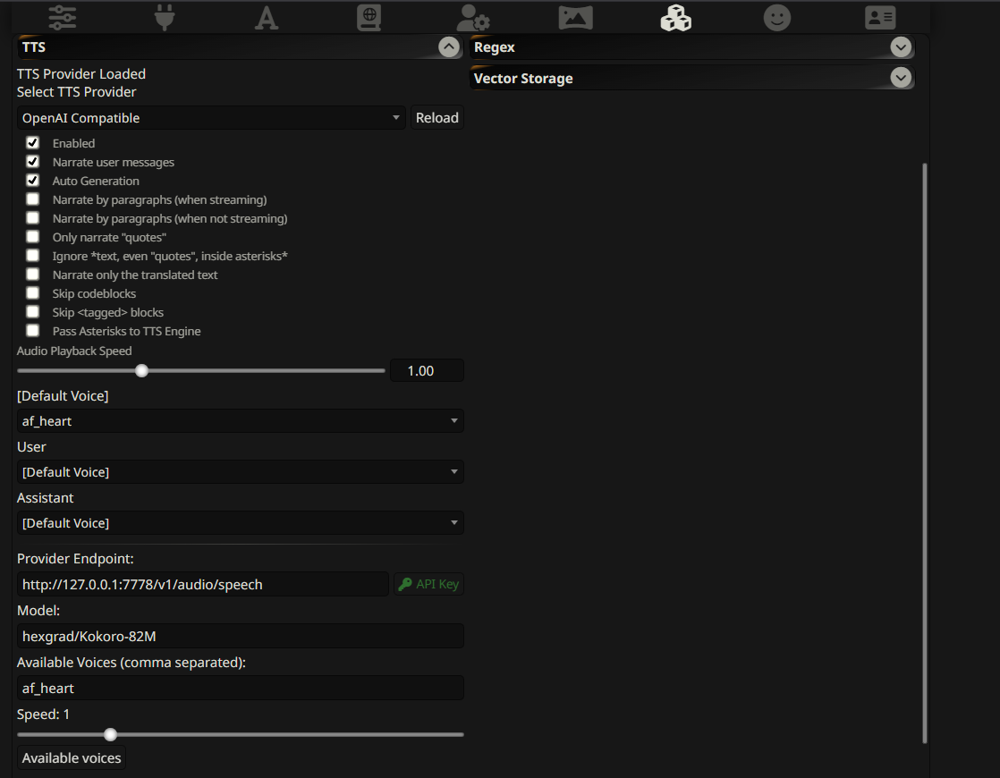
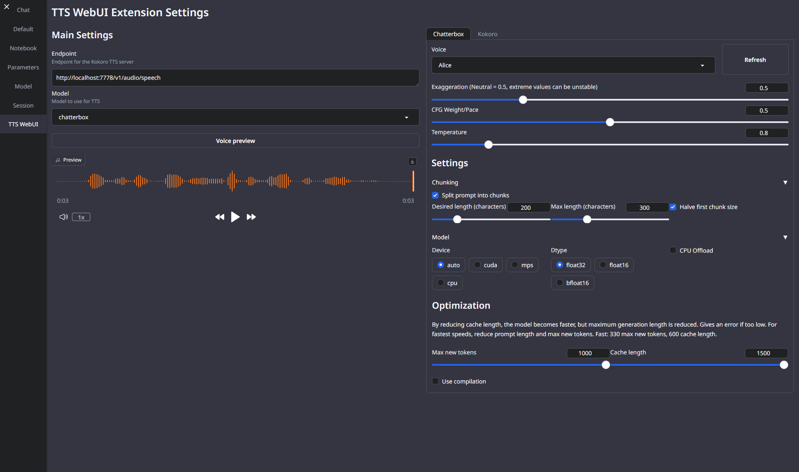
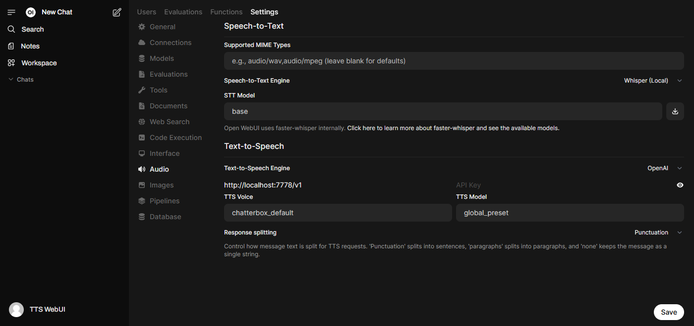

<h1 align="center">TTS WebUI / Harmonica</h1>

<div align="center">

  <h4 align="center">

  [Download Installer](https://github.com/rsxdalv/TTS-WebUI/releases/download/v0.0.0/tts-webui-installer.zip) ||
  [Installation](#installation) ||
  [Docker Setup](#docker-setup) ||
  [Silly Tavern](#integrations) ||
  [Extensions](#extensions) ||
  [Feedback / Bug reports](https://forms.gle/2L62owhBsGFzdFBC8)

  </h4>

  [](https://github.com/rsxdalv/tts-webui)

  [](https://github.com/rsxdalv/tts-webui/stargazers)
  [](https://github.com/rsxdalv/tts-webui/blob/main/LICENSE)
  [](https://discord.gg/V8BKTVRtJ9)
  [](https://colab.research.google.com/github/rsxdalv/tts-webui/blob/main/notebooks/google_colab.ipynb)
  [](https://github.com/rsxdalv/tts-webui/network/members)
  [](https://www.youtube.com/@TTS-WebUI)

</div>

<div align="center">

## Videos

</div>

| [](https://youtu.be/JXojhFjZ39k) | [](https://youtu.be/YvM3DdRHDsI) | [](https://youtu.be/_0rftbXPJLI) |
| :------------------------------------------------------------------------------------------------------: | :------------------------------------------------------------------------------------------------------: | :------------------------------------------------------------------------------------------------------: |

<div align="center">

## Examples

</div>


| <video src="https://github.com/user-attachments/assets/16ac948a-fe98-49ad-ad87-19c41fe7e65e" width="300"></video> | <video src="https://github.com/user-attachments/assets/55bde4f7-bbcc-4ecf-8f94-b315b9d22e74" width="300"></video> | <video src="https://github.com/user-attachments/assets/fcee8906-a101-400d-8499-4e72c7603042" width="300"></video> |
| :-----------------------------------------: | :-----------------------------------------: | :-------------------------------: |

<div align="center">

## Screenshots

</div>

| .png) | .png) | .png) |
| :-----------------------------------------: | :-----------------------------------------: | :-------------------------------: |

| .png) | .png) | .png) |
| :-----------------------------------------: | :-----------------------------------------: | :-------------------------------: |

<div align="center">

## Supported Models

| Text-to-speech                                                                      | Audio/Music Generation                                                                | Audio Conversion/Tools                                                       |
| ----------------------------------------------------------------------------------- | ------------------------------------------------------------------------------------- | ---------------------------------------------------------------------------- |
| [Bark](https://github.com/suno-ai/bark)                                             | [MusicGen](https://github.com/facebookresearch/audiocraft/blob/main/docs/MUSICGEN.md) | [RVC](https://github.com/RVC-Project/Retrieval-based-Voice-Conversion-WebUI) |
| [Tortoise](https://github.com/neonbjb/tortoise-tts)                                 | [MAGNeT](https://github.com/facebookresearch/audiocraft/blob/main/docs/MAGNET.md)     | [Demucs](https://github.com/facebookresearch/demucs)                         |
| [Maha TTS](https://github.com/dubverse-ai/MahaTTS)                                  | [Stable Audio](https://github.com/Stability-AI/stable-audio-tools)                    | [Vocos](https://github.com/gemelo-ai/vocos)                                  |
| [MMS](https://github.com/facebookresearch/fairseq/blob/main/examples/mms/README.md) | [Riffusion\*](https://github.com/riffusion/riffusion-hobby)                           | [Whisper](https://github.com/openai/whisper)                                 |
| [Vall-E X](https://github.com/Plachtaa/VALL-E-X)                                    | [AudioCraft Mac\*](https://github.com/trizko/audiocraft)                              | [AP BWE](https://github.com/yxlu-0102/AP-BWE)                                |
| [StyleTTS2](https://github.com/sidharthrajaram/StyleTTS2)                           | [AudioCraft Plus\*](https://github.com/GrandaddyShmax/audiocraft_plus)                | [Resemble Enhance](https://github.com/resemble-ai/resemble-enhance)          |
| [SeamlessM4T](https://github.com/facebookresearch/seamless_communication)           | [ACE-Step\*](https://github.com/ACE-Step/ACE-Step)                                    | [Audio Separator](https://github.com/nomadkaraoke/python-audio-separator)    |
| [XTTSv2\*](https://github.com/coqui-ai/TTS)                                         |                                                                                       | [PyRNNoise\*](https://github.com/rsxdalv/extension_pyrnnoise)                |
| [MARS5\*](https://github.com/camb-ai/mars5-tts)                                     |                                                                                       |                                                                              |
| [F5-TTS\*](https://github.com/SWivid/F5-TTS)                                        |                                                                                       |                                                                              |
| [Parler TTS\*](https://github.com/huggingface/parler-tts)                           |                                                                                       |                                                                              |
| [OpenVoice\*](https://github.com/myshell-ai/OpenVoice)                              |                                                                                       |                                                                              |
| [OpenVoice V2\*](https://github.com/myshell-ai/OpenVoice)                           |                                                                                       |                                                                              |
| [Kokoro TTS\*](https://github.com/hexgrad/kokoro)                                   |                                                                                       |                                                                              |
| [DIA\*](https://github.com/nari-labs/dia)                                           |                                                                                       |                                                                              |
| [CosyVoice\*](https://github.com/FunAudioLLM/CosyVoice)                             |                                                                                       |                                                                              |
| [GPT-SoVITS\*](https://github.com/X-T-E-R/GPT-SoVITS-Inference)                     |                                                                                       |                                                                              |
| [Piper TTS\*](https://github.com/rhasspy/piper)                                     |                                                                                       |                                                                              |
| [Kimi Audio 7B Instruct\*](https://github.com/Dao-AILab/Kimi-Audio)                 |                                                                                       |                                                                              |
| [Chatterbox\*](https://github.com/rsxdalv/chatterbox)                               |                                                                                       |                                                                              |
| [VibeVoice\*](https://github.com/rsxdalv/extension_vibevoice)                       |                                                                                       |                                                                              |
| [Kitten TTS\*](https://github.com/rsxdalv/extension_kitten_tts)                     |                                                                                       |                                                                              |

\* These models are not installed by default, instead they are available as extensions.

</div>


## Installation

### Using the Installer (Recommended)

Current base installation size is around 10.7 GB. Each model will require 2-8 GB of space in addition.

* Download the [latest version](https://github.com/rsxdalv/TTS-WebUI/releases/download/v0.0.0/tts-webui-installer.zip) and extract it.
* Run start_tts_webui.bat or start_tts_webui.sh to start the server. It will ask you to select the GPU/Chip you are using. Once everything has installed, it will start the Gradio server at http://localhost:7770 and the React UI at http://localhost:3000.
* Output log will be available in the installer_scripts/output.log file.
* Note: The start script sets up a conda environment and a python virtual environment. Thus you don't need to make a venv before that, and in fact, launching from another venv might break this script.

### Manual installation

Prerequisites:
* git
* Python 3.10 or 3.11 (3.12 not supported yet)
* PyTorch
* ffmpeg (with vorbis support)
* (Optional) NodeJS 22.9.0 for React UI
* (Optional) PostgreSQL 16.4+ for database support

1. Clone the repository:
   ```bash
   git clone https://github.com/rsxdalv/tts-webui.git
   cd tts-webui
   ```
2. Install required packages:
    ```bash
    pip install -r requirements.txt
    ```

3. Run the server:
   ```bash
   python server.py --no-react
   ```

4. For React UI:
   ```bash
   cd react-ui
   npm install
   npm run build
   cd ..
   python server.py
   ```

For detailed manual installation instructions, please refer to the [Manual Installation Guide](./documentation/manual_installation.md).

### Docker Setup

tts-webui can also be ran inside of a Docker container. Using CUDA inside of docker requires [NVIDIA Container Toolkit](https://docs.nvidia.com/datacenter/cloud-native/container-toolkit/latest/install-guide.html). To get started, pull the image from GitHub Container Registry:

```
docker pull ghcr.io/rsxdalv/tts-webui:main
```

Once the image has been pulled it can be started with Docker Compose:
The ports are 7770 (env:TTS_PORT) for the Gradio backend and 3000 (env:UI_PORT) for the React front end.

```
docker compose up -d
```

The container will take some time to generate the first output while models are downloaded in the background. The status of this download can be verified by checking the container logs:

```
docker logs tts-webui
```

#### Building the image yourself
If you wish to build your own docker container, you can use the included Dockerfile:

```
docker build -t tts-webui .
```
Please note that the docker-compose needs to be edited to use the image you just built.


## Changelog

September:
* OpenAI API now supports Whisper transcriptions
* Removed PyTorch Nightly option
* Fix Google Colab installation (Python 3.12 not supported)
* Add Kitten TTS Mini extension
* Add PyRNNoise extension
* Upgrade React UI's Chatterbox interface
* Rename Kokoro TTS extension to OpenAI TTS API extension
* Rename all extensions to tts_webui_extension.*
* Switch to PyPI for multiple extensions
* Add Intel PyTorch installation option
* Add "Custom" Choice option to installer for self-managed PyTorch installations
* Integrate with new pip index for extensions (https://tts-webui.github.io/extensions-index/)
* Add Xiaomi's MiMo Audio extension

August:
* Fix model downloader when no token is used, thanks Nusantara.
* Improve Chatterbox speed
* Add VibeVoice (Early Access) extension
* Add docker compose volumes to persist data #529, thanks FranckKe.
* [react-ui] Prepend voices/chatterbox to voice file selection in ap test page #542, thanks rohan-sircar.

July: 
* Add new tutorials
* Add more robust gradio launching
* Simplify installation instructions
* Improve chatterbox speed.

## Past Changes

See the [2025 Changelog](./documentation/changelog-2025.md) for a detailed list of changes in 2025.

See the [2024 Changelog](./documentation/changelog-2024.md) for a detailed list of changes in 2024.

See the [2023 Changelog](./documentation/changelog-2023.md) for a detailed list of changes in 2023.

## Extensions

Extensions are available to install from the webui itself, or using React UI. They can also be installed using the extension manager. Internally, extensions are just python packages that are installed using pip. Multiple extensions can be installed at the same time, but there might be compatibility issues between them. After installing or updating an extension, you need to restart the app to load it.

Updates need to be done manually by using the mini-control panel:




## Integrations

### Silly Tavern

1. Update OpenAI TTS API extension to latest version
2. Start the API and test it with Python Requests
 
   *(OpenAI client might not be installed thus the Test with Python OpenAI client might fail)*

3. Once you can see the audio generates successfully, go to Silly Tavern, and add a new TTS API
   Default provider endpoint: `http://localhost:7778/v1/audio/speech`
   
4. Test it out!

### Text Generation WebUI (oobabooga/text-generation-webui)

1. Install https://github.com/rsxdalv/text-to-tts-webui extension in text-generation-webui
2. Start the API and test it with Python Requests
3. Configure using the panel: 

### OpenWebUI 

1. Enable OpenAI API extension in TTS WebUI
2. Start the API and test it with Python Requests
3. Once you can see the audio generates successfully, go to OpenWebUI, and add a new TTS API
   Default provider endpoint: `http://localhost:7778/v1/audio/speech`
4. Test it out!


### OpenAI Compatible APIs

Using the instructions above, you can install an OpenAI compatible API, and use it with Silly Tavern or other OpenAI compatible clients.

## Compatibility / Errors

### Red messages in console
These messages:
```
---- requires ----, but you have ---- which is incompatible.
```
Are completely normal. It's both a limitation of pip and because this Web UI combines a lot of different AI projects together. Since the projects are not always compatible with each other, they will complain about the other projects being installed. This is normal and expected. And in the end, despite the warnings/errors the projects will work together.
It's not clear if this situation will ever be resolvable, but that is the hope.


## Extra Voices for Bark, Prompt Samples
<div align="center">

[](https://promptecho.com/)

[](https://rsxdalv.github.io/bark-speaker-directory/)

</div>

## Bark Readme
[README_Bark.md](./documentation/README_Bark.md)

## Info about managing models, caches and system space for AI projects
https://github.com/rsxdalv/tts-webui/discussions/186#discussioncomment-7291274


## Open Source Libraries

<details>
<summary>This project utilizes the following open source libraries:</summary>

- **suno-ai/bark** - [MIT License](https://github.com/suno-ai/bark/blob/main/LICENSE)
  - Description: Inference code for Bark model.
  - Repository: [suno/bark](https://github.com/suno-ai/bark)

- **tortoise-tts** - [Apache-2.0 License](https://github.com/neonbjb/tortoise-tts/blob/master/LICENSE)
  - Description: A flexible text-to-speech synthesis library for various platforms.
  - Repository: [neonbjb/tortoise-tts](https://github.com/neonbjb/tortoise-tts)

- **ffmpeg** - [LGPL License](https://github.com/FFmpeg/FFmpeg/blob/master/LICENSE.md)
  - Description: A complete and cross-platform solution for video and audio processing.
  - Repository: [FFmpeg](https://github.com/FFmpeg/FFmpeg)
  - Use: Encoding Vorbis Ogg files

- **ffmpeg-python** - [Apache 2.0 License](https://github.com/kkroening/ffmpeg-python/blob/master/LICENSE)
  - Description: Python bindings for FFmpeg library for handling multimedia files.
  - Repository: [kkroening/ffmpeg-python](https://github.com/kkroening/ffmpeg-python)

- **audiocraft** - [MIT License](https://github.com/facebookresearch/audiocraft/blob/main/LICENSE)
  - Description: A library for audio generation and MusicGen.
  - Repository: [facebookresearch/audiocraft](https://github.com/facebookresearch/audiocraft)

- **vocos** - [MIT License](https://github.com/charactr-platform/vocos/blob/master/LICENSE)
  - Description: An improved decoder for encodec samples
  - Repository: [charactr-platform/vocos](https://github.com/charactr-platform/vocos)

- **RVC** - [MIT License](https://github.com/RVC-Project/Retrieval-based-Voice-Conversion-WebUI/blob/main/LICENSE)
  - Description: An easy-to-use Voice Conversion framework based on VITS.
  - Repository: [RVC-Project/Retrieval-based-Voice-Conversion-WebUI](https://github.com/RVC-Project/Retrieval-based-Voice-Conversion-WebUI)
</details>

## Ethical and Responsible Use
This technology is intended for enablement and creativity, not for harm.

By engaging with this AI model, you acknowledge and agree to abide by these guidelines, employing the AI model in a responsible, ethical, and legal manner.
- Non-Malicious Intent: Do not use this AI model for malicious, harmful, or unlawful activities. It should only be used for lawful and ethical purposes that promote positive engagement, knowledge sharing, and constructive conversations.
- No Impersonation: Do not use this AI model to impersonate or misrepresent yourself as someone else, including individuals, organizations, or entities. It should not be used to deceive, defraud, or manipulate others.
- No Fraudulent Activities: This AI model must not be used for fraudulent purposes, such as financial scams, phishing attempts, or any form of deceitful practices aimed at acquiring sensitive information, monetary gain, or unauthorized access to systems.
- Legal Compliance: Ensure that your use of this AI model complies with applicable laws, regulations, and policies regarding AI usage, data protection, privacy, intellectual property, and any other relevant legal obligations in your jurisdiction.
- Acknowledgement: By engaging with this AI model, you acknowledge and agree to abide by these guidelines, using the AI model in a responsible, ethical, and legal manner.

## License

### Codebase and Dependencies

The codebase is licensed under MIT. However, it's important to note that when installing the dependencies, you will also be subject to their respective licenses. Although most of these licenses are permissive, there may be some that are not. Therefore, it's essential to understand that the permissive license only applies to the codebase itself, not the entire project.

That being said, the goal is to maintain MIT compatibility throughout the project. If you come across a dependency that is not compatible with the MIT license, please feel free to open an issue and bring it to our attention.

Known non-permissive dependencies:
| Library     | License           | Notes                                                                                     |
|-------------|-------------------|-------------------------------------------------------------------------------------------|
| encodec     | CC BY-NC 4.0      | Newer versions are MIT, but need to be installed manually                                  |
| diffq       | CC BY-NC 4.0      | Optional in the future, not necessary to run, can be uninstalled, should be updated with demucs |
| lameenc     | GPL License       | Future versions will make it LGPL, but need to be installed manually                      |
| unidecode   | GPL License       | Not mission critical, can be replaced with another library, issue: https://github.com/neonbjb/tortoise-tts/issues/494 |


### Model Weights
Model weights have different licenses, please pay attention to the license of the model you are using.

Most notably:
- Bark: MIT
- Tortoise: *Unknown* (Apache-2.0 according to repo, but no license file in HuggingFace)
- MusicGen: CC BY-NC 4.0
- AudioGen: CC BY-NC 4.0

